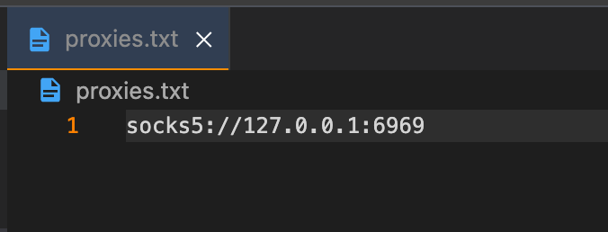

# Musii
A python cli to search for tracks using the Deezer API with support for proxies

## Features
- Supports proxies
- Fast and lightweight

## Setup / Installation
Install the required dependencies via `pip3`

```
  pip3 install -r requirements.txt
```
    
## Usage / Examples
```
  $ python3 musii.py --help

  Usage: musii.py [OPTIONS] QUERY...
  Options:
      --count INTEGER  Number of results to display
      --type TEXT      Method to use when searching (track, artist, album, etc)
      --noproxy        Use direct connection without proxy
      --help           Show this message and exit.

```

**Example of searching for a track:**
```
  $ python3 musii.py glaive - astrid --type track
  
  [i] Searching for 'glaive - astrid' with type track and showing 1 result. (using proxy)
  [*] Result 1: astrid by Glaive: https://www.deezer.com/track/1008321682
```

## Using Proxies
To use proxies with Musii, create a file named `proxies.txt` in the root of this repository.

You can put your proxy IPs in this file, like shown below:


## License
[MIT](https://choosealicense.com/licenses/mit/)
